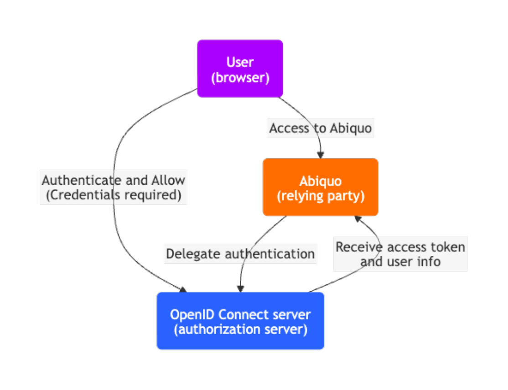
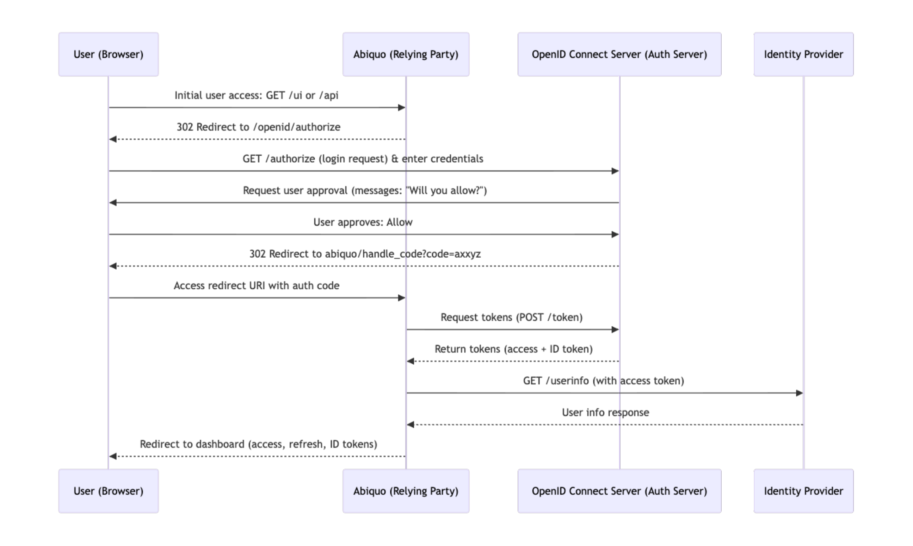

# Abiquo OpenID Connect integration

## Introduction

This page describes the Abiquo integration with [OpenID Connect](https://openid.net/connect/) available in Abiquo. This integration lets Abiquo leverage single sign-on authentication and federated authorization features.

The integration targets the [core spec](https://openid.net/specs/openid-connect-core-1_0.html), but also implements some optional features such as the  [*RP-Initiated-Logout*](https://openid.net/specs/openid-connect-session-1_0.html#RPLogout) from the optional Session Management spec.

Discovery, dynamic registration, and other optional features are out of the scope of this integration.

Changes to the OpenID integration in Abiquo 5.1.2

A new Abiquo configuration property was introduced in Abiquo 5.1.2

* `abiquo.login.samesite`

Changes to the OpenID integration in Abiquo 4.6

Two new Abiquo configuration properties were introduced in Abiquo 4.6.0

* `abiquo.openid.cookie.maxage`  
* `abiquo.openid.cookie.refreshtoken.include`

Changes to the OpenID integration in Abiquo 3.10.7 and 4.0.4

To retrieve the user's phone number from the OpenID system, add `phone` to the value list of the `abiquo.openid.client.scopes` property.  
Abiquo doesn't validate the phone number.

## Basic workflow

In the OpenID basic workflow, the user interacts with Abiquo (the Application), which is also a client of the OpenID Connect server (the Identity Server).

The following diagram shows the basic authentication and authorization workflow when using the OpenID Connect integration.


[Flowchart Mermaid file](diagrams/openid_flowchart.md)

The authorization process is as follows:

1. Users access the Abiquo portal and it redirects them to the OpenID Connect server
2. Users enter their credentials to log in to the OpenID Connect server (the credentials are never exposed to Abiquo). It displays the consent screen that describes the permissions that Abiquo is requesting and the information it needs to access.  
3. Upon successful authentication and consent grant, the OpenID Connect server issues the following tokens and redirects the user back to the application:  
   1. **ID token** \- A JWT token containing the information about the user.  
   2. **Access token** \- An OAuth token that provides access to the application resources on behalf of the user.  
   3. **Refresh token** \- An optional token to refresh the access token when it expires.
4. Abiquo uses the access token to request information about the logged user (such as permissions) and creates the corresponding user in the Abiquo database.  
5. Users access the Abiquo platform, including the Abiquo API, with the access token.  

Notes:

* At any time, users with the refresh token can call the Abiquo API to refresh the access token.
* If you configure global logout, when users sign out from the Abiquo platform, it signs them out of the OpenID Connect server.

## ACR validation

In an OpenID Connect Integration, the authorization request can contain a list of authentication modes that the server should show to the user. This is a list of acr-values and it's a configuration of the OpenID Connect Server.

So Abiquo may request that using the acr-values system property.

Also, the response tokens can contain the acr-values used by the user to authenticate. Abiquo can validate that these acr-values are the requested ones if the acr-validation system property enables this, and fail the authentication process if they aren't.

## OpenID Connect authentication mode

When Abiquo is in normal authentication mode, Abiquo authenticates and obtains user authorization from the Abiquo database.  
In contrast, when the platform is in OpenID Connect mode, Abiquo authenticates and obtains user authorization from the OpenID Connect server. In OpenID mode, Abiquo behaves as follows:

* Abiquo creates an Abiquo OpenID user automatically under the following conditions:  
  * The user successfully authenticates through the OpenID Connect server;  
  * And Abiquo finds an Abiquo tenant and user role that matches the one specified through the OpenID user data.
* Every time the user logs in, Abiquo synchronizes user data with the OpenID Connect server, which overwrites any changes you make to the Abiquo user account.  
  * A user that has switched enterprises returns to their assigned enterprise when they log in.
* Abiquo deactivates login for users with non-OpenID accounts.  
  * This includes the main cloud admin user.
* Abiquo deactivates features associated with normal authentication, such as Abiquo two-factor authentication, and Abiquo password reset.  
  * The OpenID Connect server should provide this type of feature when authenticating users.

## OpenID Connect configuration steps

This is an overview of the steps to configure the OpenID Connect Integration.

1. Configure cloud admin user with Abiquo in normal auth mode  
2. Map OpenID users to Abiquo enterprises and roles with Abiquo in normal auth mode  
3. Register Abiquo as a client application on the OpenID Connect server and obtain OpenID client credentials  
4. Configure the OpenID Connect server in `abiquo.properties`  
5. Register the Abiquo Outbound API as an OAuth application and configure `abiquo.properties`  
6. Configure the OpenID Connect logout  
7. Configure Abiquo UI properties  
8. Start the Abiquo Server  
9. Configure API and Outbound API clients to work with an access token

## Configure the cloud admin user

Configure the cloud admin user with Abiquo in normal authentication mode.  
Remember that Abiquo deactivates this user when you enable OpenID Connect authentication mode.

## Map OpenID Connect users to Abiquo enterprises and roles

In OpenID Connect authentication mode, when a user successfully authenticates through the OpenID Connect server, Abiquo receives OpenID user data. Abiquo tries to match the user data to the following in Abiquo:

* A user role such as cloud admin, tenant admin, cloud user  
* An enterprise (cloud tenant) that the user belongs to

To enable Abiquo to match the user, you must work in Abiquo to **map** the Abiquo enterprise and role to the OpenID user data. Work in normal authentication mode as the cloud admin user. If Abiquo can't find the role and enterprise, it won't create the OpenID user.

### **How Abiquo determines which role to assign to an OpenID user**

The OpenID Connect server returns user data, including a list of the external roles/permissions for the user, which is called a role claim. Abiquo identifies the role claim in the OpenID user data using the name you configure with the `abiquo.openid.role-claim` property. Abiquo searches for an existing Abiquo role with the same LDAP attribute data as the role claim.

### Map external roles to Abiquo roles

To map OpenID roles to an Abiquo role:

1. Create, clone or edit an Abiquo role  
2. In the External Roles field, enter the same list of external roles/permissions as the OpenID user's role claim

Remember that a user's external roles must map to one local role in their enterprise and/or one global role.

### How Abiquo determines which enterprise an OpenID user should belong to

The OpenID Connect server returns user data, including the tenant that a user should belong to, which is called an enterprise claim. Abiquo can look up this enterprise in Abiquo by enterprise name or by enterprise property.  
If Abiquo can't find the enterprise, it won't allow the user to log in. If the user account doesn't exist, Abiquo will creates it in the enterprise. If the user account exists in another enterprise, Abiquo moves it to the one assigned by the OpenID Connect server.

Abiquo obtains the enterprise claim defined by the `abiquo.openid.enterprise-claim` property.  
Abiquo matches the enterprise claim to the enterprise name if the `abiquo.openid.enterprise-property` property isn't set in `abiquo.properties`.  
Otherwise, it matches the value of the enterprise claim to the value of the enterprise property specified by the `abiquo.openid.enterprise-property` property.

### **Map external enterprises to Abiquo enterprises**

Map external enterprises to Abiquo enterprises according to the lookup method you configured for your platform.

To map an OpenID enterprise to an Abiquo enterprise by **enterprise name**, set the name of the enterprise to the value in the enterprise claim.

To map an OpenID enterprise to an Abiquo enterprise by **enterprise property**:

1. Create or edit an Abiquo enterprise  
2. Create an enterprise property with the key configured in the `abiquo.openid.enterprise-property` in `abiquo.properties`. For example, for `abiquo.openid.enterprise-property = domain`, create an enterprise property called `domain`  
3. Set the value of this property to the value of the enterprise claim for this tenant

When the authorization server returns the enterprise claim, Abiquo looks for all enterprises with a `domain` property. It finds the one with the value that matches the value returned by the OpenID Connect server. In the example, when the OpenID Connect server returns the value `http://abiquo.com` in the enterprise claim, Abiquo selects the enterprise.

## Register Abiquo as a client application in the OpenID Connect server

Register Abiquo as a client application in the OpenID system and obtain the client credentials: `client name`, `client id` and `client secret`. Configure these in `abiquo.properties` in the next step.

## Configure Abiquo properties

To configure OpenID Connect in `abiquo.properties`:

1. Configure OpenID Connect server details including endpoints and claims
2. Configure OpenID client credentials from the previous step of registering Abiquo as a client application
3. Activate OpenID in `abiquo.properties`, by setting `abiquo.auth.module` to `openid`

If your OpenID Connect provider implements the [Discovery](https://openid.net/specs/openid-connect-discovery-1_0.html) extension, you may be able to get the value of the different endpoints. To do this, go to the well-known configuration endpoint, as described in the [provider configuration](https://openid.net/specs/openid-connect-discovery-1_0.html#ProviderConfig) section.

## OpenID sequence diagram

The following sequence diagram shows how to use the different endpoints from a user and relying party perspective.
The diagram depicts the interactions between all parties involved in the OpenID Connect protocol.



[Sequence diagram Mermaid file](diagrams/openid_sequence_diagram.md)

### Table of Abiquo OpenID Connect properties

To enable the OpenID Connect mode, configure the following properties in Abiquo:

| Property | Description |
| :---- | :---- |
| ***OpenID Connect server configuration*** |  |
| **abiquo.auth.module** | The Abiquo authentication module. Must be: `openid` |
| **abiquo.openid.cookie.maxage** | After the OpenID authentication flow, the API redirect adds a cookie with the access token and the id token. The expiry of the OpenID authentication cookie in seconds. A negative value means that the cookie isn't stored persistently and will be deleted when the web browser exits. A zero value causes the cookie to be deleted. *Default: 30* |
| **abiquo.openid.cookie.refreshtoken.include** | If true, the OpenID authentication cookie also contains the refresh token. *Default: false* |
| **abiquo.openid.target** | The URL where the user is redirected from the Identity Server upon successful authentication. Something like `http://<abiquo ui host>/ui/#/dashboard` |
| **abiquo.openid.role-claim** | The name of the claim returned by the authorization server that contains the names used to map the user permissions to an Abiquo role |
| **abiquo.openid.enterprise-claim** | The name of the claim returned by the authorization server that contains the names used to map the Abiquo enterprise where the user belongs |
| **abiquo.openid.enterprise-property** | (Optional) If present, Abiquo searches for an enterprise that has a property with the name configured in this property. It uses the value to match the "enterprise claim" when resolving the user's enterprise. If absent, Abiquo looks for an enterprise with the name returned in the "enterprise claim". |
| **abiquo.openid.issuer** | The OpenID Connect authorization issuer. |
| **abiquo.openid.authorization.endpoint** | The OpenID Connect authorization endpoint. ***This endpoint must be accessible from the user's browser*** |
| **abiquo.openid.token.endpoint** | The OpenID Connect token endpoint. This endpoint must be accessible from the Abiquo server. |
| **abiquo.openid.userinfo.endpoint** | The OpenID Connect user info endpoint. This endpoint must be accessible from the Abiquo server. |
| **abiquo.openid.jwks.endpoint** | The OpenID Connect JWKS endpoint. This endpoint must be accessible from the Abiquo server. |
| **abiquo.openid.endsession.endpoint** | (Optional) If configured, Abiquo attempts to perform a global logout performing a request to this endpoint. This is part of the [Session Management](http://openid.net/specs/openid-connect-session-1_0.html) optional spec. ***This endpoint must be accessible from the user's browser.*** |
| ***OpenID Connect client configuration*** |  |
| **abiquo.openid.client.name** | The name of the client on the OpenID Connect server for the Abiquo platform. |
| **abiquo.openid.client.id** | The ID of the client on the OpenID Connect server for the Abiquo platform. |
| **abiquo.openid.client.secret** | The secret of the client on the OpenID Connect server for the Abiquo platform. |
| **abiquo.openid.client.scopes** | Comma separated list of scopes to request during authentication. Must have, at least: `openid,profile,email`. Also supports: `phone`. |
| **abiquo.openid.client.redirect-uris** | Comma separated list of allowed redirect (callback) URIs used during the authentication flow. Must be: `http://<api endpoint>/api/openid_connect_login` |
| **abiquo.openid.client.acr-values** | Space separated values for the acr values to send to OpenID Connect Server when authenticating. They are validated if the `acr-validation` property is true (default value). |
| **abiquo.openid.client.acr-validation** | Activates the acr values validation. Default value is true |

## **Configure Abiquo outbound API module**

Register the Outbound API as an OAuth application (for Outbound API user or admin user) and use the tool to obtain the OAuth access token. Configure credentials in abiquo.properties and remove any old credentials properties

In OpenID Connect mode, the normal authentication (using HTTP Basic Authentication) is deactivated, so you must configure the Outbound API credentials as OAuth tokens. To do this:

1. Create a new application for the  "default api outbound user"  as explained in the  "Manage OAuth Applications"  guide, and set all the privileges for that user; OR  
   Create the application in the administrator account, and select only the permissions for the  "default api outbound user"  
2. Get the OAuth access tokens. You can use an unsupported Abiquo utility to obtain the access tokens.  
   Contact Abiquo Support to obtain the Abiquo utility.  
3. In the `abiquo.properties` file of the Abiquo Server  
   1. Configure the following OAuth properties  
      1. `abiquo.m.consumerKey`  
      2. `abiquo.m.consumerSecret`  
      3. `abiquo.m.accessToken`  
      4. `abiquo.m.accessTokenSecret`  
   2. **And remove** the following properties  
      1. `abiquo.m.identity`  
      2. `abiquo.m.credential`

## **Configure OpenID Connect logout**

If the OpenID Connect server implements the [Session Management](https://openid.net/specs/openid-connect-session-1_0.html) extension, you can configure the Abiquo platform to issue a logout to the OpenID Connect server when the user logs out from the platform.  
This is optional because users may not want to log out from all services when logging out from Abiquo.

To enable the global logout, configure the `abiquo.openid.endsession.endpoint` property to point to the end session endpoint, as defined by the [RP-Initiated Logout](http://openid.net/specs/openid-connect-session-1_0.html#RPLogout) spec.

## **Configure OpenID Connect client UI properties**

Configure the OpenID Connect client UI properties in the `client-config-custom.json` file.

| Property | Description |
| :---- | :---- |
| `client.openid.enabled` | **Deprecated in Abiquo 4.7.1** |
| `client.openid.skip.login.view` | **Deprecated in Abiquo 4.7.1 for UI 5\.**. By default, when in OpenID mode, Abiquo shows an initial screen with a link to the Authentication portal. If this property is `true`, then Abiquo doesn't display the initial screen and it redirects users directly to the Authentication portal. |
| `client.skip.login.view` | By default, when in OpenID mode, Abiquo shows an initial screen with a link to the Authentication portal. If this property is `true`, Abiquo doesn't display the initial screen and it redirects users directly to the Authentication portal. |
| `client.auth.module` | Abiquo login modules to use with options for Basic Auth (default), Open ID, and SAML. See `client-config-default.json` for examples. |

## Configure API and outbound clients

In OpenID Connect mode, Abiquo deactivates Basic Authentication, so use an access token to authenticate with the API (or against the Outbound API endpoint).

Abiquo still supports authentication using the session cookie or Abiquo OAuth applications as before.

To obtain an access token:

1. Manually log in to the platform  
2. When you are redirected to the Abiquo console, the access token and refresh token are in the URI.

Using the token, you can issue requests to the API by providing the following HTTP header: `[Lost in conversion]`

## **Optional SameSite cookie flag configuration**

On the Abiquo Server, optionally set the `abiquo.login.samesite` property to control the value of the `SameSite` flag of the login cookie. See [Abiquo Configuration Properties\#samesite](https://wiki.abiquo.com/display/doc/Abiquo+Configuration+Properties#AbiquoConfigurationProperties-samesite)

## Refreshing access tokens

Access tokens have an expiration, so at some time they stop working. When this happens, the user can use a refresh token to request a new access token, if the refresh token was returned during authentication. Refresh tokens also expire, but have a significantly longer life time (the default is one week).  
Some OpenID Connect providers issue new refresh tokens every time an access token is refreshed, In this case, the refresh mechanism can be used without limit.

To request a new access token using a refresh token, an HTTP request must be issued to the `openid_connect_refresh` Abiquo API endpoint, passing the refresh token as a query parameter:

```
/api/openid\_connect\_refresh?refresh\_token=" \-H "Accept: application/vnd.abiquo.oidctokens+json"\\n\\n{\\n "scope" : "openid profile email abiquo",\\n "id\_token" : "eyAidHlwIjogIkpXVCIsICJraWQiOiAiemhCb2ZiWncraSIsICJhbGciOiAiUlMyNTYiIH0.eyAiYXRfaGFzaCI6ICJoVmJBZ2t2NGRBalh5bFFQZGNYVFR3IiwgInN1YiI6ICJvcGVuaWQtYWRtaW4iLCAiYXVkaXRUcmFja2luZ0lkIjogIjcxN2I3YWY0LTNmMGQtNGU2NS1iZWJmLWE3MWIzODg4MWE1My05NTcwIiwgImlzcyI6ICJodHRwOi8vb3BlbmFtLmJjbi5hYmlxdW8uY29tOjgwL29wZW5hbS9vYXV0aDIvZGV2ZWxvcGVycyIsICJ0b2tlbk5hbWUiOiAiaWRfdG9rZW4iLCAiZ3JvdXBzIjogWyAiaWQ9YWRtaW5zLG91PWdyb3VwLG89ZGV2ZWxvcGVycyxvdT1zZXJ2aWNlcyxkYz1vcGVuYW0sZGM9Zm9yZ2Vyb2NrLGRjPW9yZyIgXSwgImdpdmVuX25hbWUiOiAiT3BlbklEIiwgImF1ZCI6ICJhYmlxdW8iLCAib3JnLmZvcmdlcm9jay5vcGVuaWRjb25uZWN0Lm9wcyI6ICJhNWExMDNlYS05MmQyLTQxZDgtOGJkYi0xMWNjZTJmMGZlYjMiLCAiYXpwIjogImFiaXF1byIsICJhdXRoX3RpbWUiOiAxNDczOTU5Njk2LCAiZG9tYWluIjogIkFiaXF1byIsICJuYW1lIjogIk9wZW5JRCBBZG1pbiIsICJyZWFsbSI6ICIvZGV2ZWxvcGVycyIsICJleHAiOiAxNDczOTYzMjk2LCAidG9rZW5UeXBlIjogIkpXVFRva2VuIiwgImlhdCI6IDE0NzM5NTk2OTYsICJmYW1pbHlfbmFtZSI6ICJBZG1pbiIsICJlbWFpbCI6ICJvcGVuaWQtYWRtaW5AYWJpcXVvLmNvbSIgfQ.JL3yUCtn4VnGewANcD2SbqX5RZfxKqNQG\_p2vc5UldRIxdr4BNg3u-C219-XA8dfnrLvBL6CmrJoItIy7XDP7qX8DJO7a9pea8QCugXT9NdepdQh-SEPdQ3d-acm4M5\_1bALIjvItDW7pWVnqppYUyjVzQY\_oX385CccUuYaYh-9Glj-9VPdnr9pZXZFkb07K0ab2iQtfu7sshS6-iZ0mF6unF2pWvsJHfeUSYb1X9yRfehhRgTXltlVno7uNEfPopM6MbISr-Bhb7zxiJ-Zte\_peaiZKjrU7QEQFDIj13M6YQ",\\n "refresh\_token" : "78ecb72e-fd0e-4825-ae0a-635159c461ff",\\n "token\_type" : "Bearer",\\n "links" : \[\],\\n "expires\_in" : 3599,\\n "access\_token" : "a381c059-654f-4c03-852b-cf507c5372ec"\\n}
```

This is because it is meant to be used when the access token is expired. So the Abiquo API passes the refresh token to the authorization server and lets it verify the validity of the token and the identity associated with it.

## **Troubleshooting**

The OpenID login process can return an error message, for example, due to a delayed login or timeout.  
To prevent this, for Internet Explorer cookies, in `server.xml` on Abiquo Tomcat, the `<Host\>` section should contain an `<Alias\>` section with the domain of the web server (where users access the UI).  
And the default Java session timeout was changed to 30 minutes to ensure user delays during OpenID login won't result in further errors.
