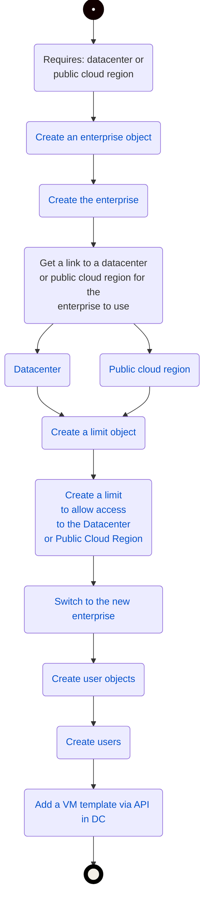

```mermaid
graph TD

Z(( ))

style Z fill:#f1f1f1,stroke:#100,stroke-width:20px

Z-->A(Requires: datacenter or<br/>public cloud region)

A -->B(<font color=#0052cc>Create an enterprise object</font>)

click B href "https://wiki.abiquo.com/api/latest/enterprise.html" _blank

B -->C(<font color=#0052cc>Create the enterprise</font>)

click C href "https://wiki.abiquo.com/api/latest/EnterprisesResource.html#create-an-enterprise" _blank

C-->D(Get a link to a datacenter<br/>or public cloud region for the<br/>enterprise to use)

D-->E(<font color=#0052cc>Datacenter</font>)

click E href "https://wiki.abiquo.com/api/latest/DatacentersResource.html#list-datacenter-names-and-ids" _blank

D-->E1(<font color=#0052cc>Public cloud region</font>)

click E1 href "https://wiki.abiquo.com/api/latest/PublicCloudRegionsResource.html#list-public-cloud-regions" _blank

E-->F(<font color=#0052cc>Create a limit object</font>)

E1-->F 

click F href "https://wiki.abiquo.com/api/latest/limit.html" _blank

F-->G(<font color=#0052cc>Create a limit<br/>to allow access<br/>to the Datacenter<br/> or Public Cloud Region</font>)

click G href "https://wiki.abiquo.com/api/latest/EnterpriseLimitsByDatacentersResource.html#create-a-datacenter-limit" _blank

G-->H(<font color=#0052cc>Switch to the new enterprise</font>)

click H href "https://wiki.abiquo.com/display/doc/How+to+switch+enterprises+via+API" _blank

H-->I(<font color=#0052cc>Create user objects</font>)

click I href "https://wiki.abiquo.com/api/latest/user.html" _blank

I-->J(<font color=#0052cc>Create users</font>)

click J href "https://wiki.abiquo.com/api/latest/UsersResource.html#create-a-user-in-an-enterprise" _blank

J-->K(<font color=#0052cc>Add a VM template via API in DC</font>)

click K href "https://abiquo.atlassian.net/wiki/spaces/doc/pages/311376104/How+to+add+a+VM+template+in+a+datacenter+via+API" _blank

K-->Q((<font color=#f3efe6> \* </font>))
    style Q fill:#f3efe6,stroke:#030300,stroke-width:7px,color:#f3efe6
```