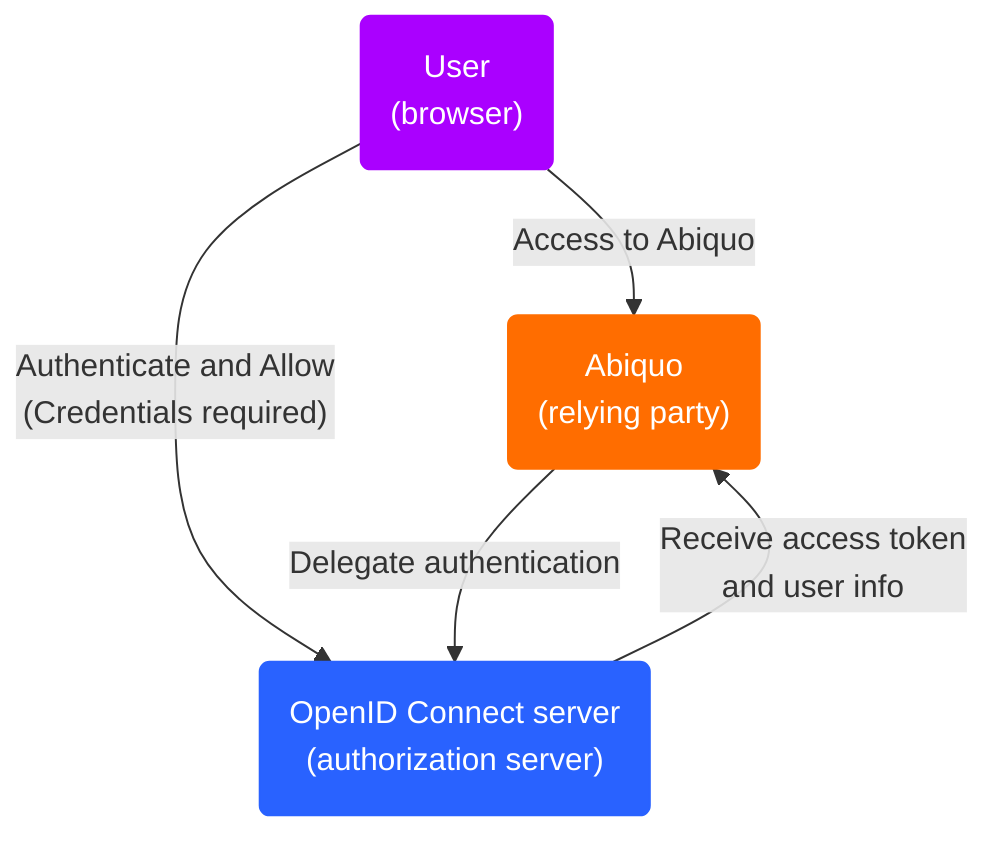

```mermaid
flowchart TD
        A("User 
        (browser)")
        B("OpenID Connect server
        (authorization server)") 
        C("Abiquo
        (relying party)")

        A -- Access to Abiquo --> C
        A -- Authenticate and Allow</br>(Credentials required) --> B 
        B -- Receive access token</br>and user info --> C
        C -- Delegate authentication --> B

        style A color:#FFFFFF, fill:#AA00FF, stroke:#AA00FF
        style C color:#FFFFFF, stroke:#FF6D00, fill:#FF6D00
        style B color:#FFFFFF, stroke:#2962FF, fill:#2962FF
```
