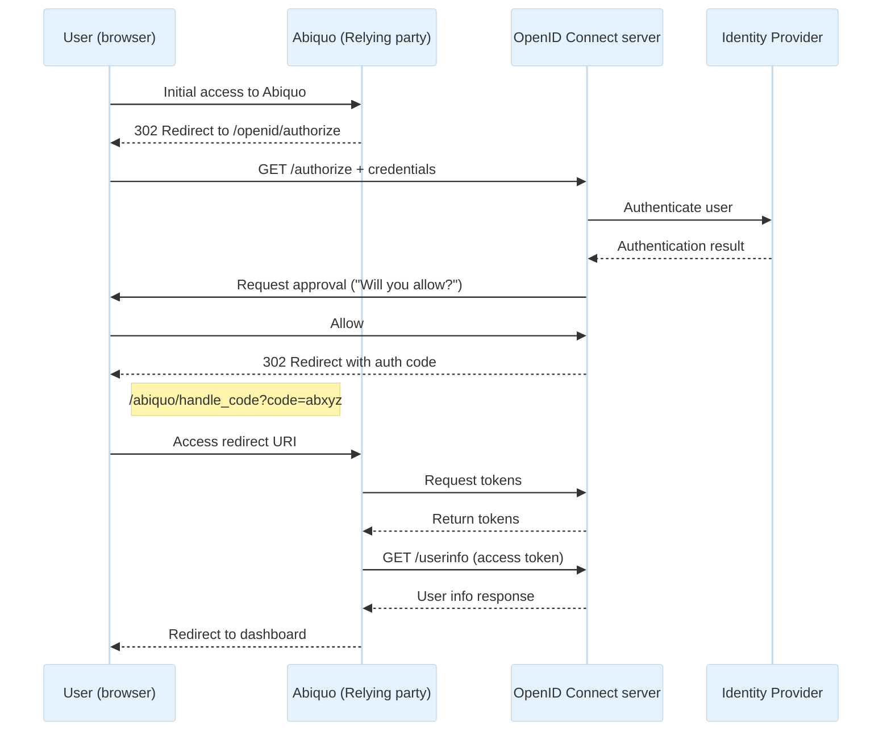

```mermaid
%%{init: {
  "theme": "base",
  "themeVariables": {
    "primaryColor": "#E3F2FD",
    "secondaryColor": "#FFF3E0",
    "tertiaryColor": "#ECEFF1",
    "lineColor": "#90A4AE",
    "fontSize": "14px"
  }
}}%%
sequenceDiagram
    participant U as User (browser)
    participant A as Abiquo (Relying party)
    participant O as OpenID Connect server
    participant I as Identity Provider

    %% Flow
    U->>A: Initial access to Abiquo
    A-->>U: 302 Redirect to /openid/authorize

    U->>O: GET /authorize + credentials
    O->>I: Authenticate user
    I-->>O: Authentication result

    O->>U: Request approval ("Will you allow?")
    U->>O: Allow

    O-->>U: 302 Redirect with auth code
    Note right of U: /abiquo/handle_code?code=abxyz

    U->>A: Access redirect URI
    A->>O: Request tokens
    O-->>A: Return tokens

    A->>O: GET /userinfo (access token)
    O-->>A: User info response

    A-->>U: Redirect to dashboard
```
ç